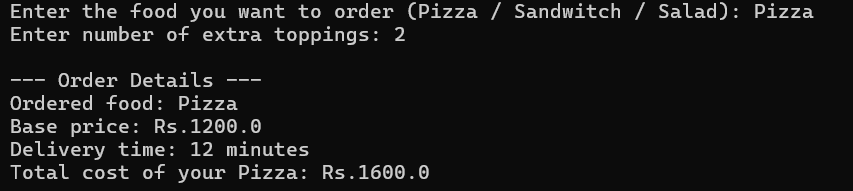

# 🍕 Food Order Management System (Java)

A simple Java-based console application that demonstrates **abstraction**, **inheritance**, and **polymorphism** using a food delivery system. Users can place orders for Pizza, Sandwich, or Salad with customizable options, and the program calculates the final cost dynamically.

---

## 📌 Features

- Abstract class implementation (`Foodorder`)
- Inheritance for specific food types (`Pizzaorder`, `Sandwitchorder`, `Saladorder`)
- Calculates final cost based on user input
- Clean and structured console output
- Input validation and basic logic branching

---

## 🛠️ Technologies Used

- Java (OOP Concepts)
- Console-based user input/output

---

## 🚀 How to Run

1. **Save the code** as `Fooddelivery.java`.

2. **Open your terminal / CMD** in the saved folder.

3. **Compile the code**:
   ```bash
   javac Fooddelivery.java
```

Run the compiled program:
  ```bash
  java Fooddelivery
```
---

## 🧪 Sample Run


## ✍️ Author
**S.D.Tasuntha Chathunika** 
🎓 University of Vavuniya – Faculty of Information and Communication Technology  
📅 Date: 2025-06-09
🔗 [GitHub Profile](https://github.com/Tasuntha-Chathunika)
